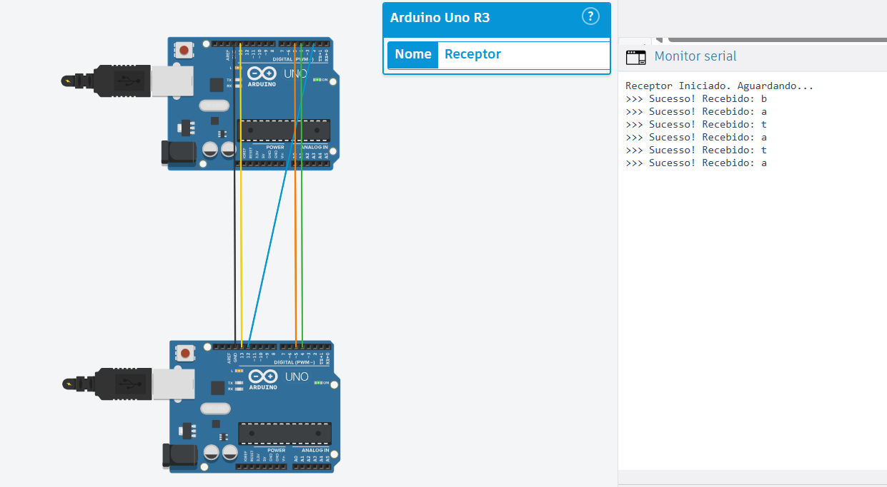
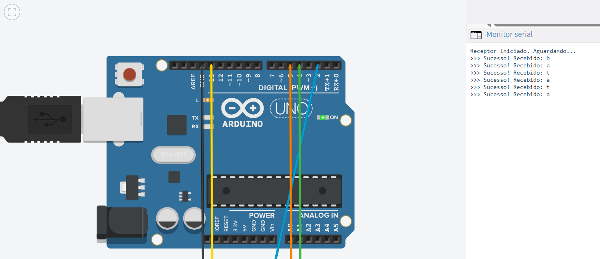

##  Sobre o Projeto: O Desafio da Camada Física

### Integrantes do Grupo:
- Adhemar Molon Neto
- Jorge Augusto Salgado Salhani
- Laura Neri Thomaz da Silva

### Vídeo produzido: 
[Youtube - Arduino Receptor de Paridade Par](https://youtu.be/5XR75sju2yo)

Este projeto foi desenvolvido como atividade prática da disciplina de **Redes de Computadores** (SSC0142). O desafio estrutural era descer ao nível do hardware e construir um protocolo de comunicação do zero, inspirando-se no clássico RS-232C, mas adaptando-o para uma arquitetura com sincronização explícita.

A especificação do trabalho exigia três pilares fundamentais, que foram implementados da seguinte maneira:

### 1. Comunicação Síncrona (O Relógio Compartilhado)
* **O Desafio:** Ao invés de uma transmissão assíncrona comum (onde cada máquina precisa prever o *baud rate*), os Arduinos precisavam compartilhar um sinal de *Clock* físico.
* **A Solução:** O Arduino Emissor gera um pulso de relógio manipulando o hardware em background através do `TIMER1`. Esse sinal viaja pelo Pino 12 até o Pino 2 do Receptor. O Receptor não precisa "adivinhar" o tempo: ele utiliza uma **Interrupção de Hardware** (`attachInterrupt` na borda de subida) para ler a linha de dados no milissegundo exato em que o clock pulsa.

### 2. Controle de Erros (Paridade Par)
* **O Desafio:** Garantir um mecanismo de integridade para detectar se o ruído eletromagnético no fio corrompeu algum bit durante a viagem.
* **A Solução:** Implementamos a regra de **Paridade Par**. Para cada caractere ASCII de 8 bits, o sistema conta a quantidade de bits `1`. O 9º bit transmitido no pacote é o "Bit de Paridade", calculado de forma que a soma total de bits `1` viajando no fio seja sempre um número par. Se o Receptor receber um pacote com uma quantidade ímpar de `1`s, ele descarta a leitura e acusa "Erro de Paridade".

### 3. Handshake (Controle de Fluxo Físico)
* **O Desafio:** Estabelecer um acordo entre as máquinas para que o Emissor não "afogue" o Receptor enviando dados antes dele estar pronto para processar.
* **A Solução:** Utilizamos duas linhas de controle dedicadas: **RTS** (*Request to Send*) e **CTS** (*Clear to Send*). O Emissor levanta o sinal RTS pedindo permissão para falar e entra em estado de espera. Quando o Receptor está com sua rotina livre, ele levanta o CTS. Somente após esse "aperto de mãos" o Clock é acionado e a transmissão dos bits começa.

---

###  Validação do Protocolo
Abaixo, a nossa simulação validada. O log do Monitor Serial demonstra o Receptor processando o fluxo de dados em tempo real, validando o bit de paridade par a cada pacote recebido e reconstruindo a string com sucesso (exemplo com a palavra "batata"):

*(A arquitetura respeita o isolamento de hardware: GND comum referenciando os circuitos, linha amarela para a carga útil de dados, azul para o clock síncrono e as linhas verde/laranja garantindo o Handshake).*

---

## Anatomia do Nó Receptor (`Receptor.ino`)

Na nossa topologia ponto a ponto, o Receptor atua como a máquina passiva da comunicação (o "escravo" do relógio). Seu código não possui rotinas de temporização interna (`Temporizador.h`); em vez disso, ele é totalmente orientado a eventos (Hardware Interrupts), garantindo reatividade imediata aos sinais físicos do barramento.

O ciclo de vida da recepção segue a seguinte máquina de estados:

### 1. Escuta Ativa e Estabelecimento do Canal
O sistema inicia em estado de repouso, monitorando continuamente a linha de controle **RTS**. Quando o nível lógico desta linha sobe (o Emissor solicitando o canal), o Receptor limpa seus registradores internos e levanta a linha **CTS**, finalizando o *Handshake* inicial. O canal físico está oficialmente aberto.

### 2. Amostragem Síncrona (O Fim do *Drift* de Relógio)
Em protocolos assíncronos tradicionais, pequenas variações no oscilador das placas podem causar *drift* (deslizamento), onde o receptor lê o bit no momento errado. 

Para resolver isso de forma síncrona, a linha de Clock do Emissor foi conectada ao pino de **Interrupção Externa (Pino 2)** do Receptor. O código utiliza um gatilho de borda de subida (`RISING`). Isso significa que a cada transição exata de `0V` para `5V` na linha de relógio, o hardware do Arduino suspende o laço principal e executa a leitura instantânea da linha de Dados (Pino 13). A sincronia é garantida pela física, não por atrasos de software.

### 3. Desencapsulamento e Reconstrução
A cada interrupção validada, o Receptor reconstrói o byte da carga útil (*payload*). Os 8 primeiros pulsos de clock preenchem a variável do caractere, enquanto o 9º pulso é armazenado isoladamente como o bit de paridade do pacote.

### 4. Controle de Erros e Liberação (Tear-down)
Ao detectar que a linha RTS retornou a zero, o Receptor sabe que a transmissão física terminou. Ele então entra na fase de validação:
* Conta-se o número de bits `1` presentes na carga útil somados ao bit de paridade recebido.
* Aplica-se a regra da **Paridade Par**: se o total de `1`s for divisível por 2 (resto zero), o dado é considerado íntegro e é processado para a camada superior (impresso no Serial Monitor).
* Caso seja ímpar, o sistema acusa corrupção do pacote no meio físico.

Por fim, o Receptor rebaixa a linha CTS, realizando o *tear-down* (desmontagem) da conexão e ficando livre para o próximo caractere.

