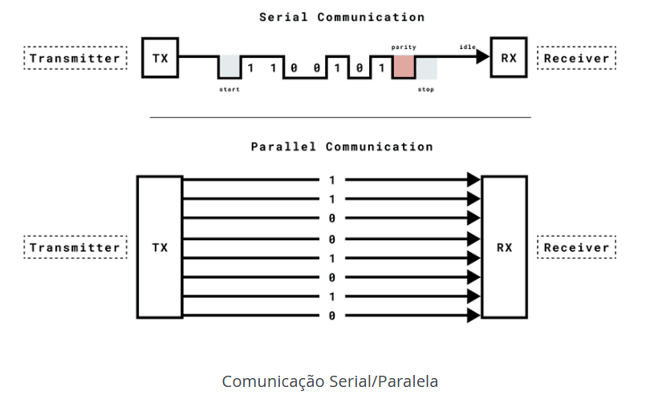
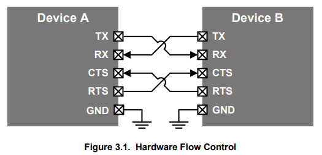

# Comunicação Serial

Método de envio e recebimento de informações bit a bit

No caso do Arduíno Uno, o barramento de dados (paralelo, com cada dado armazenado simultaneamente) transfere para a interface UART (Universal Asynchronous Receiver-Transmitter), que utiliza dos pinos 0 (Rx) e 1 (Tx) para receber ou transmitir, respectivamente, dados de forma serial. São comuns os protocolos TTL (Transistor-Transistor Logic) e EIA RS 232 (Recommended Standard), com padrões [RS-232-C](https://bitsavers.trailing-edge.com/pdf/datapro/communications_standards/2740_EIA_RS-232-C.pdf) ou [EIA-232-F](https://www.ti.com/lit/an/slla037a/slla037a.pdf)

*Comunicação Serial/Paralela. Imagem obtida no link: https://docs.arduino.cc/learn/communication/uart/*

Para comunicação assíncrona, é necessário que emissor e receptor concordem de antemão com a taxa com a qual dados serão transmitidos (baud rate). Já para a comunicação síncrona, deve existir sincronização na transmissão de dados via sinal de clock (handshake)

Para melhorar a concordância ou sincronização de dados, o controle de fluxo é importante na comunicação entre dispositivos para evitar a perda de dados. Caso receptor R de dados esteja sobrecarregado (ou seja, processamento do receptor é mais lento que envio de dados pelo transmissor T) R precisa informar a T sobre a interrupção da transmissão por um intervalo de tempo. Para UART, em hardware podemos obter controle de fluxo via novas linhas de dados [RTS (Request to Send) e CTS (Clear to Send)](https://www.silabs.com/documents/public/application-notes/an0059.0-uart-flow-control.pdf)

*Controle de Fluxo em Hardware: CTS/RTS. Imagem obtida no link: https://www.silabs.com/documents/public/application-notes/an0059.0-uart-flow-control.pdf*