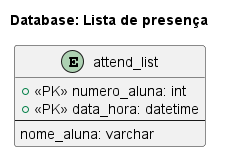
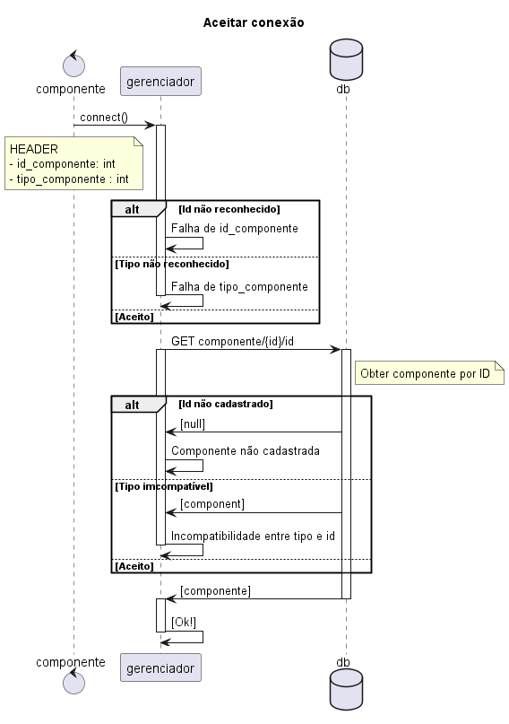
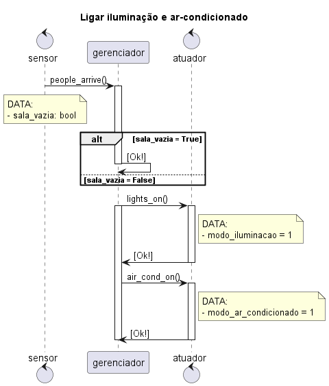
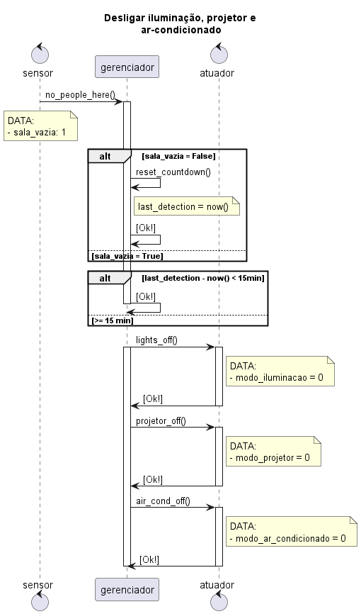
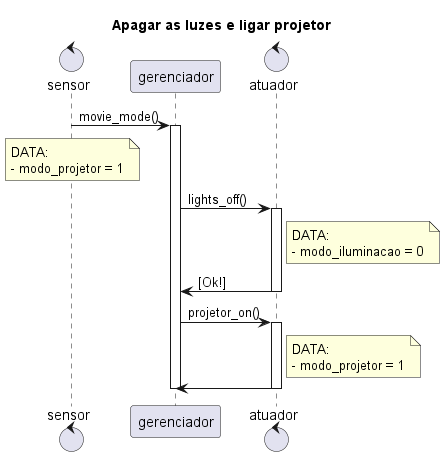
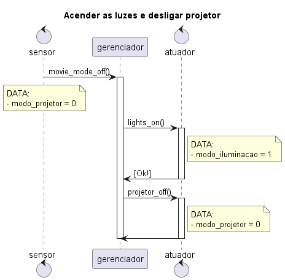
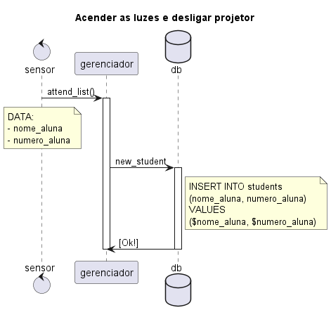
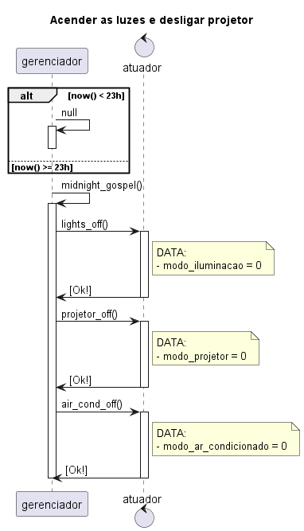
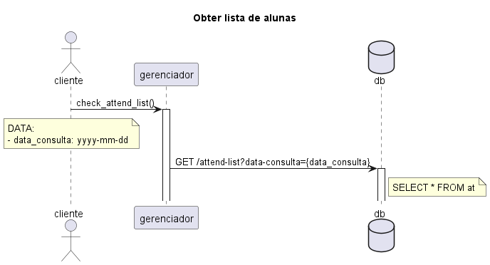

# Gerenciador

## Protocolo de mensagem

HEADER | DATA 

HEADER: 
1. **id_sensor**: identificador da componente
2. **tipo_componente**: tipo da componente
3. **aceitar_sinal**: flag (0|1) para que o sinal recebido seja efetivamente reconhecido como um comando

> **Hipótese:**
> 
> Existe uma lista com cada componente previamente cadastrada (aqui referido como **db**, embora não necessariamente seja uma base de dados no sentido formal)

DATA:
1. modo: bool (= switch ON/OFF)

## Database

## Requisitos Funcionais

### 3.1. O Gerenciador deverá aceitar a conexão de sensores e atuadores do sistema

### 3.2. Quando forem detectadas pessoas, o gerenciador deve ligar o sistema de iluminação e o ar condicionado.

### 3.3. Quando não houver detecção de pessoas por 15 minutos seguidos, o gerenciador deve desligar o sistema de iluminação, o projetor e o ar-condicionado.

### 3.4. Quando a chave do projetor for ligada, o gerenciador deve apagar as luzes e ligar o projetor.

### 3.5. Quando a chave do projetor for desligada, o gerenciador deve ligar as luzes e apagar o projetor.

### 3.6. O Gerenciador deve guardar a lista de alunos que confirmaram presença na aula através do leitor de cartão.

### 3.7. O Gerenciador deve desligar todos os equipamentos às 23h.

### 3.8. O Gerenciador deve ser capaz de fornecer ao Cliente (professor) a lista de alunos que confirmou presença em aula.

